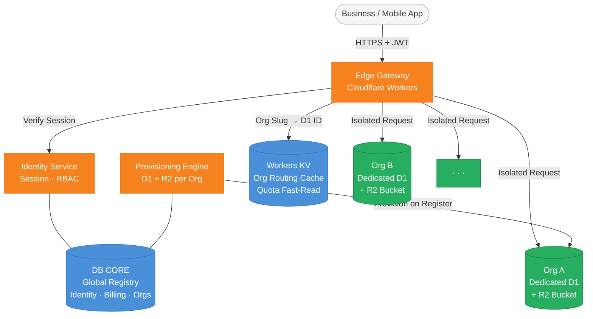

# SNAPPY Business OS
**The operating system for independent Indonesian businesses.**  
Built on isolated infrastructure. No shared databases. No compromise.

---

## At a Glance

| | |
|---|---|
| **Infrastructure** | Cloudflare Workers · D1 · R2 · KV · Queues |
| **Isolation Model** | 1 Organization = 1 Dedicated Database |
| **Modules** | 24+ across Operations, Finance, HR, Compliance |
| **Tiers** | RAKJAT (Free) → PERINTIS → OESAHA → MADJOE → DJAJA → ADIKARYA |
| **Edge Latency** | Sub-100ms globally · Sub-10ms org resolution via KV |
| **Regulatory** | PSE Registered `022966.01/DJAI.PSE/04/2026` · UU PDP · e-Faktur |
| **Uptime Target** | 99.9% · Jakarta Edge Primary |
| **Security** | Mozilla HTTP Observatory: 135/100 · DNSSEC · DMARC · Zero-Password Auth |

---

## System Architecture

Every organization is physically isolated. No org shares compute state, database rows, or storage buckets with another. This is enforced at provisioning — not as a policy, as a physical constraint.

---

## Module Ecosystem

| Category | Modules |
|---|---|
| **Operations** | POS Lite · POS Pro · ERP Lite · ERP Pro · Delivery · WMS |
| **Intelligence** | BISNAY AI · OCR Document Scan |
| **Finance** | Expense · Accounting (FIN) · PAY Gateway |
| **Human Resources** | HRIS · Payroll · Benefits · Cooperative (COOP) · Recruitment |
| **Sales & Compliance** | CRM · SIGN (TTE) · TAX (DJP e-Faktur / PPh / PPN) |
| **Project & Service** | Project Management · Field Service Management |
| **Omni-channel** | Tokopedia · Shopee · TikTok Shop Sync |
| **Platform** | FLOW Workflow · Webhooks · Custom Fields · API Keys |

---

## 📂 Documentation

| Document | Description |
|---|---|
| [Security Whitepaper](security/SECURITY_WHITEPAPER.md) | Full security architecture: encryption, zero-password auth, DNSSEC, DMARC. Mozilla Observatory: 135/100. |
| [Architecture Overview](security/architecture.md) | Service mesh, IAM, request lifecycle, observability standards. |
| [Data Model](security/data_model.md) | 1 Organization = 1 dedicated database. Physical constraint, not a policy. |
| [Full Schema Inventory](security/full_schema_inventory.md) | Every table across every module. Sensitive columns redacted for public edition. |
| [Architecture Master Map](security/architecture_map.md) | Auto-generated visual map: apps → services → database tables. |
| [Module Catalog](modules.md) | What's available on each tier — features, limits, and availability. |
| [Onboarding Flow](onboarding_flow.md) | Registration → D1 provisioning → activation gates. How a business gets started. |
| [Roadmap](roadmap.md) | What's shipped, what's building, what's planned through 2036. |

---

## 🔒 Why is this public?

Because "trust us" is not an architecture decision.

We publish our security model, data isolation design, and schema inventory so you can verify — not just believe — what's running your business.

---

## 🌐 Links

| | |
|---|---|
| **Platform** | [bisnapi.id](https://bisnapi.id) |
| **Dashboard** | [app.bisnapi.id](https://app.bisnapi.id) |
| **Status** | [status.bisnapi.id](https://status.bisnapi.id) |
| **Corporate** | [snappy.co.id](https://snappy.co.id) |

---

*Built by **PT Snappy Angkasa Media** — registered Indonesian digital infrastructure provider.*  
*PSE: `022966.01/DJAI.PSE/04/2026` · Stack: Cloudflare Workers + D1 + R2. No third-party servers.*

© 2026 PT Snappy Angkasa Media. All rights reserved.