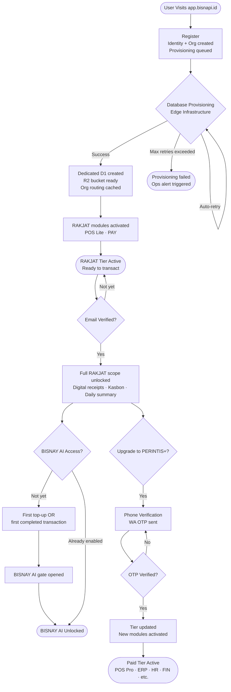

# SNAPPY Onboarding & Activation Flow

How a business goes from registration to a fully operational Business Engine — in minutes.

---

## 1. Onboarding Journey Diagram

---

## 2. Step-by-Step Technical Breakdown

### Step 1: Registration & Immediate Database Provisioning

- **Trigger**: User submits registration form at `app.bisnapi.id`.
- **What happens atomically**:
  - User identity record created with prefix-based ID.
  - Organization record created, assigned RAKJAT tier.
  - User linked to organization as Owner.
  - Provisioning job enqueued for async processing.
- **Database Provisioning** (processed asynchronously by the provisioning engine):
  1. A dedicated Cloudflare D1 database is created exclusively for this organization.
  2. The full tenant schema baseline is applied to the new database.
  3. A dedicated Cloudflare R2 storage bucket is created for this organization's assets.
  4. Organization routing entry is seeded into Workers KV for sub-10ms resolution.
  5. Initial module access gates are seeded for RAKJAT tier (`pos-lite`, `pay`).

> **D1 provisioning happens at registration — not at any later gate. Every RAKJAT org gets a real, isolated database from day 1.**

- **Resiliency**: The provisioning engine retries automatically up to 5 times with exponential backoff. If all retries fail, the ops team is alerted and the job is flagged for manual intervention. Partial provisioning is rolled back atomically.

---

### Step 2: Email Verification

- **Trigger**: User clicks magic link / enters OTP from email.
- **What happens**: Time-limited verification token is consumed. `email_verified_at` timestamp set on the user record.
- **Outcome**: Full RAKJAT scope accessible. Email-gated features are unblocked.
- **Modules activated**: `pos-lite` (kasbon, digital receipts), `pay` (QRIS, VA, e-wallet).

---

### Step 3: BISNAY AI Gate

BISNAY AI requires a qualifying signal of real business activity — not just registration.

- **Trigger** (any one of):
  - First top-up credit purchase.
  - First completed transaction record in the org database.
- **Outcome**: BISNAY AI module gate flipped to enabled. AI chat and analytics become available.

---

### Step 4: Phone Verification

Required before any tier upgrade beyond RAKJAT.

- **Trigger**: User initiates a tier upgrade.
- **What happens**: One-time 6-digit OTP sent via WhatsApp/SMS. Valid for 10 minutes. Consumed on confirmation.

---

### Step 5: Tier Upgrade & Module Unlocking

- **Trigger**: Payment confirmed via payment webhook.
- **What happens**:
  1. Organization tier updated.
  2. Invoice marked as paid.
  3. Billing cycle record created for the new period.
  4. All modules included in the new tier are activated in batch.
- **Module gate resolution**: Checked at every request in < 10ms via Workers KV cache.

---

## 3. Activation Gates — Module Slug Reference

| Module Slug   | Available From                       | Description                                  |
| ------------- | ------------------------------------ | -------------------------------------------- |
| `pos-lite`    | RAKJAT (auto)                        | Basic POS, kasbon, digital receipts          |
| `pay`         | RAKJAT (auto)                        | Payment processing                           |
| `bisnay`      | RAKJAT (gate: first invoice/payment) | AI analytics — shared pool, 10 credits/day   |
| `pos`         | PERINTIS                             | Full POS, multi-terminal, kitchen display    |
| `erp-lite`    | PERINTIS                             | Basic stock management, supplier directory   |
| `expense`     | PERINTIS                             | Expense claims and reimbursement             |
| `erp`         | MADJOE                               | Full ERP, multi-warehouse, FIFO batching     |
| `fin`         | MADJOE                               | Double-entry accounting, bank reconciliation |
| `tax`         | MADJOE                               | DJP e-Faktur, PPh, PPN compliance            |
| `flow`        | MADJOE                               | Workflow automation and approval chains      |
| `hris`        | OESAHA                               | HR, attendance, leave management             |
| `sign`        | OESAHA                               | Electronic signatures (TTE)                  |
| `crm`         | OESAHA                               | Full CRM, deal pipeline, loyalty             |
| `coop`        | OESAHA                               | Employee cooperative (Koperasi)              |
| `ocr`         | Add-on (OESAHA+)                     | Document scanning and auto-fill              |
| `omni`        | Add-on                               | Marketplace sync (Tokopedia, Shopee, TikTok) |
| `payroll`     | Add-on (MADJOE+)                     | Payroll engine, PPh 21, BPJS                 |
| `wms`         | Add-on (DJAJA)                       | Advanced warehouse, bin management           |
| `benefit`     | Add-on (DJAJA)                       | Employee benefits and insurance              |
| `recruitment` | Add-on (DJAJA)                       | Applicant tracking system                    |
| `project`     | Add-on                               | Project and milestone tracking               |
| `service`     | Add-on                               | Field service orders and visits              |
| `delivery`    | Add-on                               | Fleet and delivery management                |

---

## 4. Post-Activation Quota Enforcement

Once active, every business operation is checked against tier limits:

1. **Fast Read**: Quota checked via Workers KV in < 10ms — allow or deny before the request executes.
2. **Atomic Write**: On successful operation, quota counter incremented with optimistic locking — concurrent multi-terminal environments are safe.
3. **Sync**: Authoritative counts synced back to KV for the next fast read.

Limits are defined per tier (e.g., daily transaction count, AI credit pool, PDF generation).

---

_© 2026 PT Snappy Angkasa Media. Proprietary & Confidential._
