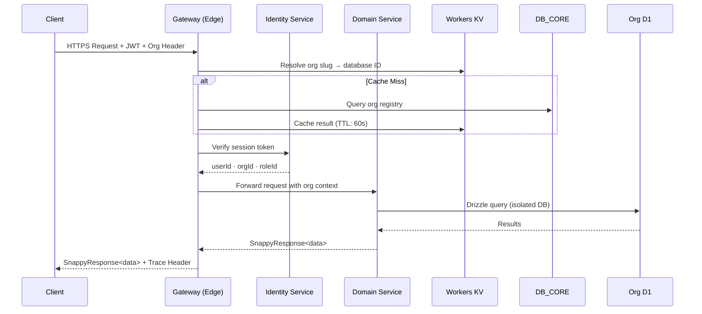

# SNAPPY Technical Architecture

The edge-native, physically isolated Business OS for Southeast Asian SMEs.

---

## 1. Core Philosophy

- **Edge-First**: Compute executed at Cloudflare Edge locations globally. Sub-100ms P99 target.
- **Physical Data Isolation**: 1 Organization = 1 Dedicated D1 Database. Not a policy — a physical constraint enforced at provisioning.
- **Extensibility Without Migrations**: Every operational table includes a `metadata_json` column, enabling schema-free extensions without ALTER TABLE across the platform lifecycle.
- **Standardized Observability**: Every API response carries a `traceId`. Every worker emits OTLP traces to Cloudflare's native telemetry pipeline.

---

## 2. Infrastructure Layer

| Component        | Technology                         |
| ---------------- | ---------------------------------- |
| Runtime          | Cloudflare Workers (V8 Isolates)   |
| Web Framework    | Hono                               |
| Primary Database | Cloudflare D1 (SQLite at the edge) |
| ORM              | Drizzle ORM                        |
| Object Storage   | Cloudflare R2                      |
| Cache / KV       | Cloudflare Workers KV              |
| Queue            | Cloudflare Queues                  |
| Internal RPC     | Cloudflare Service Bindings        |
| Observability    | OTLP → Cloudflare Traces + Sentry  |

---

## 3. Multi-Tenant Architecture

### Database Plane Separation

```
┌─────────────────────────────────────────┐
│              CONTROL PLANE              │
│   DB_CORE (Single Shared D1 Instance)   │
│                                         │
│  users / orgs / sessions / roles /      │
│  permissions / invoices / tier_config   │
└───────────────────┬─────────────────────┘
                    │ org routing (slug → d1_id)
          ┌─────────┴──────────┐
          │                    │
┌─────────▼──────┐   ┌─────────▼──────┐
│  ORG A — D1    │   │  ORG B — D1    │   ...
│  (Isolated)    │   │  (Isolated)    │
│                │   │                │
│ pos_* erp_*    │   │ pos_* erp_*    │
│ hr_* crm_*     │   │ hr_* crm_*     │
└────────────────┘   └────────────────┘
```

All business modules co-exist within the same Organization D1 instance. Module access is enforced at the routing layer via `activation_gates`.

---

## 4. Service Mesh & Request Flow

### Request Lifecycle



### Internal Service Communication

All inter-service calls use **Cloudflare Service Bindings** — direct runtime-isolated calls, no HTTP overhead, no token passing between services.

**Contract rules:**

- All responses wrapped in `SnappyResponse<T>` envelope.
- Downstream errors propagated with standardized error codes — never swallowed.
- Every call forwards the distributed trace header.

---

## 5. SnappyResponse\<T\> Spec

Standard JSON envelope for all API responses — internal and external.

```json
{
  "ok": true,
  "data": {},
  "error": {
    "code": "AUTH_INVALID_TOKEN",
    "message": "The provided token has expired.",
    "status": 401
  },
  "meta": {
    "traceId": "trace_01HX...",
    "service": "identity",
    "timestamp": 1714200000
  }
}
```

---

## 6. Identity & Access Control (IAM)

### Session Architecture

Sessions are database-backed (not stateless) to support instant revocation. Every session includes:

- Short-lived access token (JWT) for API requests.
- Long-lived refresh token — rotated on every use.
- `revoked_at` — nullable. If set, the session is immediately invalid across all devices.
- `last_activity_at` — updated on every authenticated request for idle detection.

### RBAC (Role-Based Access Control)

SNAPPY uses a granular, permission-key based RBAC system:

```
permissions          roles                role_permissions
─────────────        ──────────────       ────────────────
key (PK)         →   id (PK)          →   role_id (FK)
name                 org_id (nullable)    permission_key (FK)
module               name
description          is_system
```

- **System Roles** (`is_system = true`): Platform-wide roles (e.g., `owner`, `admin`).
- **Org Roles** (`org_id IS NOT NULL`): Custom roles scoped to a specific organization.
- **Permission Keys**: Granular action identifiers (e.g., `pos:transaction:create`, `erp:purchase_order:approve`).

---

## 7. Data Provisioning

### Org Provisioning Flow

1. User registers → identity, org, and provisioning job created atomically.
2. Provisioning engine picks up the job asynchronously.
3. A new, empty Cloudflare D1 instance is created for the org.
4. A dedicated Cloudflare R2 bucket is created for the org's assets.
5. The Genesis tenant schema baseline is applied to the new D1.
6. Organization routing is cached in Workers KV.
7. Initial module access gates are seeded for the org's tier.
8. Org record updated with database and storage coordinates.

### Retry & Resiliency

- Automatic retry with exponential backoff (1s → 2s → 4s → 8s → 16s).
- Hard cap of 5 retry attempts. Beyond that: job marked failed, ops team alerted.
- Partial provisioning is rolled back atomically — no orphaned databases.

---

## 8. Usage Tracking & Quota Enforcement

### Usage State Model

Quota tracking uses a **generalized key-value model** per organization:

```
org_id | metric               | current_value | limit_value | version
-------|--------------------- |---------------|-------------|--------
org_A  | trx_daily            | 143           | 500         | 88
org_A  | ai_credits_monthly   | 12            | 100         | 12
```

### Atomic Increment Protocol

All quota counters use **optimistic locking** via a `version` column to prevent race conditions in multi-terminal environments:

```sql
UPDATE usage_state
SET current_value = current_value + 1, version = version + 1
WHERE org_id = ? AND metric = ? AND current_value < limit_value AND version = ?
```

If 0 rows affected: limit reached or concurrent race — request is rejected or retried.

---

## 9. Resiliency Patterns

### Recurring Task Protection

- Automatic failure counter per task. After a configurable threshold, the task is disabled and the org owner is notified.

### Webhook Circuit Breaker

- Maximum 5 delivery retries per event. If all retries fail, the subscription is marked inactive automatically.

---

## 10. Observability

| Concern             | Implementation                                             |
| ------------------- | ---------------------------------------------------------- |
| Distributed Tracing | Trace ID propagated through every service hop              |
| Error Reporting     | Sentry — triggered on any `ok: false` with `status >= 500` |
| Performance Metrics | OTLP export to Cloudflare Native Traces                    |
| Audit Logging       | Immutable mutation audit trail across all modules          |

---

## 11. Security Model

- **External Tokens**: JWTs stored in `HttpOnly; Secure; SameSite=Strict` cookies.
- **Internal Communication**: Cloudflare Service Bindings — runtime-isolated, no token passing.
- **Header Sterilization**: Gateway strips all inbound headers before proxying. Only safe headers are forwarded to downstream services.
- **Content Encoding**: Gateway strips encoding headers from internal responses to prevent browser decompression hangs.

---

## 12. Deployment Architecture

Services are deployed in dependency order to ensure correct resolution at startup. The edge gateway is the sole public-facing entry point. All domain services are private — reachable only via Service Bindings, never directly from the internet.

---

## 13. Naming & Code Conventions

| Layer                    | Convention                                      |
| ------------------------ | ----------------------------------------------- |
| Files                    | `kebab-case.ts`                                 |
| JS Variables & Functions | `camelCase`                                     |
| DB Columns               | `snake_case`                                    |
| ID Prefixes              | `entity_prefix_` (e.g., `usr_`, `org_`, `ses_`) |
| Error Codes              | `UPPER_SNAKE_CASE` (e.g., `AUTH_INVALID_TOKEN`) |

**ID Generation**: All identifiers use a ULID-based generator with entity-specific prefixes. Raw random number generation is prohibited.

**Error Handling**: All errors use a typed error class with standardized codes. Raw untyped throws are prohibited.

---

_© 2026 PT Snappy Angkasa Media. Proprietary & Confidential._
