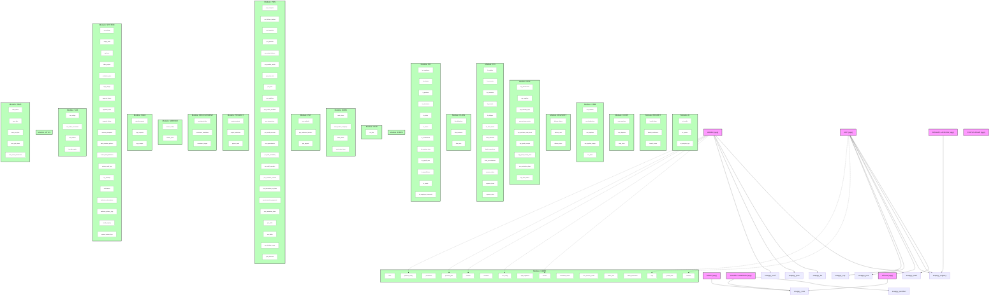

# SNAPPY Architecture Master Map (v1.0.18)

```mermaid
flowchart TD
    classDef app fill:#f9f,stroke:#333,stroke-width:2px;
    classDef core fill:#bbf,stroke:#333,stroke-width:2px;
    classDef table fill:#fff,stroke:#999,font-size:10px;
    classDef module fill:#bfb,stroke:#333,stroke-width:2px;

    subgraph DB_AI ["Module: AI"]
        direction LR
        tbl_ai_credits["ai_credits"]:::table
        tbl_ai_queries["ai_queries"]:::table
        tbl_ai_analytics_logs["ai_analytics_logs"]:::table
    end
    class DB_AI module

    subgraph DB_BENEFIT ["Module: BENEFIT"]
        direction LR
        tbl_benefit_plans["benefit_plans"]:::table
        tbl_benefit_enrollments["benefit_enrollments"]:::table
        tbl_benefit_claims["benefit_claims"]:::table
    end
    class DB_BENEFIT module

    subgraph DB_COOP ["Module: COOP"]
        direction LR
        tbl_coop_members["coop_members"]:::table
        tbl_coop_deposits["coop_deposits"]:::table
        tbl_coop_loans["coop_loans"]:::table
    end
    class DB_COOP module

    subgraph DB_CORE ["Module: CORE"]
        direction LR
        tbl_users["users"]:::table
        tbl_sessions["sessions"]:::table
        tbl_permissions["permissions"]:::table
        tbl_orgs["orgs"]:::table
        tbl_tier_config["tier_config"]:::table
        tbl_invitations["invitations"]:::table
        tbl_provision_jobs["provision_jobs"]:::table
        tbl_legal_signatures["legal_signatures"]:::table
        tbl_invoices["invoices"]:::table
        tbl_verification_tokens["verification_tokens"]:::table
        tbl_user_recovery_codes["user_recovery_codes"]:::table
        tbl_admin_roles["admin_roles"]:::table
        tbl_admin_permissions["admin_permissions"]:::table
        tbl_modules["modules"]:::table
        tbl_system_stats["system_stats"]:::table
        tbl_platform_config["platform_config"]:::table
    end
    class DB_CORE module

    subgraph DB_CRM ["Module: CRM"]
        direction LR
        tbl_crm_contacts["crm_contacts"]:::table
        tbl_crm_loyalty_logs["crm_loyalty_logs"]:::table
        tbl_crm_pipelines["crm_pipelines"]:::table
        tbl_crm_pipeline_stages["crm_pipeline_stages"]:::table
        tbl_crm_deals["crm_deals"]:::table
    end
    class DB_CRM module

    subgraph DB_DELIVERY ["Module: DELIVERY"]
        direction LR
        tbl_delivery_drivers["delivery_drivers"]:::table
        tbl_delivery_runs["delivery_runs"]:::table
        tbl_delivery_stops["delivery_stops"]:::table
    end
    class DB_DELIVERY module

    subgraph DB_ERP ["Module: ERP"]
        direction LR
        tbl_erp_warehouses["erp_warehouses"]:::table
        tbl_erp_suppliers["erp_suppliers"]:::table
        tbl_erp_inventory_logs["erp_inventory_logs"]:::table
        tbl_erp_purchase_orders["erp_purchase_orders"]:::table
        tbl_erp_purchase_order_items["erp_purchase_order_items"]:::table
        tbl_erp_goods_receipts["erp_goods_receipts"]:::table
        tbl_erp_goods_receipt_items["erp_goods_receipt_items"]:::table
        tbl_erp_production_plans["erp_production_plans"]:::table
        tbl_erp_work_orders["erp_work_orders"]:::table
    end
    class DB_ERP module

    subgraph DB_FIN ["Module: FIN"]
        direction LR
        tbl_fin_entities["fin_entities"]:::table
        tbl_fin_accounts["fin_accounts"]:::table
        tbl_fin_currencies["fin_currencies"]:::table
        tbl_fin_journals["fin_journals"]:::table
        tbl_fin_ledgers["fin_ledgers"]:::table
        tbl_fin_fixed_assets["fin_fixed_assets"]:::table
        tbl_bank_accounts["bank_accounts"]:::table
        tbl_bank_transactions["bank_transactions"]:::table
        tbl_bank_reconciliations["bank_reconciliations"]:::table
        tbl_expense_claims["expense_claims"]:::table
        tbl_expense_items["expense_items"]:::table
        tbl_expense_rates["expense_rates"]:::table
    end
    class DB_FIN module

    subgraph DB_FLOW ["Module: FLOW"]
        direction LR
        tbl_flow_definitions["flow_definitions"]:::table
        tbl_flow_instances["flow_instances"]:::table
        tbl_flow_tasks["flow_tasks"]:::table
    end
    class DB_FLOW module

    subgraph DB_HR ["Module: HR"]
        direction LR
        tbl_hr_employees["hr_employees"]:::table
        tbl_hr_salaries["hr_salaries"]:::table
        tbl_hr_positions["hr_positions"]:::table
        tbl_hr_attendance["hr_attendance"]:::table
        tbl_hr_shifts["hr_shifts"]:::table
        tbl_hr_leaves["hr_leaves"]:::table
        tbl_hr_commissions["hr_commissions"]:::table
        tbl_hr_overtime_rules["hr_overtime_rules"]:::table
        tbl_hr_payroll_runs["hr_payroll_runs"]:::table
        tbl_hr_payroll_items["hr_payroll_items"]:::table
        tbl_hr_assets["hr_assets"]:::table
        tbl_hr_employee_documents["hr_employee_documents"]:::table
    end
    class DB_HR module

    subgraph DB_INDEX ["Module: INDEX"]
        direction LR
    end
    class DB_INDEX module

    subgraph DB_OCR ["Module: OCR"]
        direction LR
        tbl_ocr_jobs["ocr_jobs"]:::table
    end
    class DB_OCR module

    subgraph DB_OMNI ["Module: OMNI"]
        direction LR
        tbl_omni_stores["omni_stores"]:::table
        tbl_omni_product_mappings["omni_product_mappings"]:::table
        tbl_omni_orders["omni_orders"]:::table
        tbl_omni_order_items["omni_order_items"]:::table
    end
    class DB_OMNI module

    subgraph DB_PAY ["Module: PAY"]
        direction LR
        tbl_pay_methods["pay_methods"]:::table
        tbl_pay_settlement_batches["pay_settlement_batches"]:::table
        tbl_pay_payouts["pay_payouts"]:::table
    end
    class DB_PAY module

    subgraph DB_POS ["Module: POS"]
        direction LR
        tbl_pos_categories["pos_categories"]:::table
        tbl_pos_kitchen_stations["pos_kitchen_stations"]:::table
        tbl_pos_terminals["pos_terminals"]:::table
        tbl_pos_products["pos_products"]:::table
        tbl_pos_serial_statuses["pos_serial_statuses"]:::table
        tbl_pos_product_serials["pos_product_serials"]:::table
        tbl_pos_price_lists["pos_price_lists"]:::table
        tbl_pos_bom["pos_bom"]:::table
        tbl_pos_modifiers["pos_modifiers"]:::table
        tbl_pos_product_modifiers["pos_product_modifiers"]:::table
        tbl_pos_transactions["pos_transactions"]:::table
        tbl_pos_credit_accounts["pos_credit_accounts"]:::table
        tbl_pos_appointments["pos_appointments"]:::table
        tbl_pos_staff_availability["pos_staff_availability"]:::table
        tbl_pos_staff_overrides["pos_staff_overrides"]:::table
        tbl_pos_customer_invoices["pos_customer_invoices"]:::table
        tbl_pos_transaction_tax_lines["pos_transaction_tax_lines"]:::table
        tbl_pos_transaction_payments["pos_transaction_payments"]:::table
        tbl_pos_transaction_items["pos_transaction_items"]:::table
        tbl_pos_shifts["pos_shifts"]:::table
        tbl_pos_tables["pos_tables"]:::table
        tbl_pos_kitchen_queue["pos_kitchen_queue"]:::table
        tbl_pos_discounts["pos_discounts"]:::table
    end
    class DB_POS module

    subgraph DB_PROJECT ["Module: PROJECT"]
        direction LR
        tbl_project_projects["project_projects"]:::table
        tbl_project_milestones["project_milestones"]:::table
        tbl_project_tasks["project_tasks"]:::table
    end
    class DB_PROJECT module

    subgraph DB_RECRUITMENT ["Module: RECRUITMENT"]
        direction LR
        tbl_recruitment_jobs["recruitment_jobs"]:::table
        tbl_recruitment_candidates["recruitment_candidates"]:::table
        tbl_recruitment_stages["recruitment_stages"]:::table
    end
    class DB_RECRUITMENT module

    subgraph DB_SERVICE ["Module: SERVICE"]
        direction LR
        tbl_service_orders["service_orders"]:::table
        tbl_service_visits["service_visits"]:::table
    end
    class DB_SERVICE module

    subgraph DB_SIGN ["Module: SIGN"]
        direction LR
        tbl_sign_documents["sign_documents"]:::table
        tbl_sign_requests["sign_requests"]:::table
        tbl_sign_stamps["sign_stamps"]:::table
    end
    class DB_SIGN module

    subgraph DB_SYSTEM ["Module: SYSTEM"]
        direction LR
        tbl_org_settings["org_settings"]:::table
        tbl_usage_state["usage_state"]:::table
        tbl_api_keys["api_keys"]:::table
        tbl_billing_cycles["billing_cycles"]:::table
        tbl_activation_gates["activation_gates"]:::table
        tbl_topup_ledger["topup_ledger"]:::table
        tbl_approval_chains["approval_chains"]:::table
        tbl_approval_steps["approval_steps"]:::table
        tbl_approval_history["approval_history"]:::table
        tbl_recurring_templates["recurring_templates"]:::table
        tbl_data_retention_policies["data_retention_policies"]:::table
        tbl_custom_field_definitions["custom_field_definitions"]:::table
        tbl_system_audit_logs["system_audit_logs"]:::table
        tbl_sys_backups["sys_backups"]:::table
        tbl_notifications["notifications"]:::table
        tbl_webhook_subscriptions["webhook_subscriptions"]:::table
        tbl_webhook_delivery_logs["webhook_delivery_logs"]:::table
        tbl_media_registry["media_registry"]:::table
        tbl_system_incident_logs["system_incident_logs"]:::table
    end
    class DB_SYSTEM module

    subgraph DB_TAX ["Module: TAX"]
        direction LR
        tbl_tax_configs["tax_configs"]:::table
        tbl_tax_umkm_summaries["tax_umkm_summaries"]:::table
        tbl_tax_invoices["tax_invoices"]:::table
        tbl_tax_djp_reports["tax_djp_reports"]:::table
    end
    class DB_TAX module

    subgraph DB_UTILS ["Module: UTILS"]
        direction LR
    end
    class DB_UTILS module

    subgraph DB_WMS ["Module: WMS"]
        direction LR
        tbl_wms_zones["wms_zones"]:::table
        tbl_wms_bins["wms_bins"]:::table
        tbl_wms_pick_lists["wms_pick_lists"]:::table
        tbl_wms_pick_items["wms_pick_items"]:::table
        tbl_wms_stock_movements["wms_stock_movements"]:::table
    end
    class DB_WMS module

    snappy_admin["ADMIN (app)"]:::app
    snappy_admin --> snappy_auth
    snappy_admin --> snappy_be
    snappy_admin --> snappy_prov
    snappy_admin --> snappy_mail
    snappy_admin -.-> tbl_invoices
    snappy_admin -.-> tbl_tier_config
    snappy_admin -.-> tbl_modules
    snappy_admin -.-> tbl_provision_jobs
    snappy_admin -.-> tbl_platform_config
    snappy_app["APP (app)"]:::app
    snappy_app --> snappy_auth
    snappy_app --> snappy_registry
    snappy_app --> snappy_registry
    snappy_app --> snappy_legal
    snappy_app --> snappy_pos
    snappy_app --> snappy_erp
    snappy_app -.-> tbl_sessions
    snappy_app -.-> tbl_orgs
    snappy_bisnapi["BISNAPI-LANDING (app)"]:::app
    snappy_bisnapi --> snappy_registry
    snappy_deck["DECK (app)"]:::app
    snappy_deck --> snappy_core
    snappy_legal["LEGAL (app)"]:::app
    snappy_legal --> snappy_core
    snappy_landing["SNAPPY-LANDING (app)"]:::app
    snappy_landing --> snappy_sentinel
    snappy_landing --> snappy_core
    snappy_status_portal["STATUS-PAGE (app)"]:::app

```
